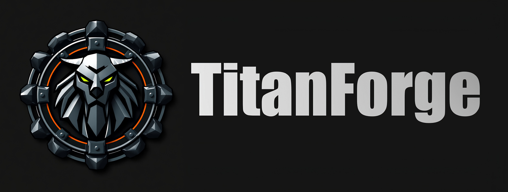

[](https://naterex.github.io/titanforge/)

# TitanForge 



<br>

This project contains the software libraries that together make up the TitanForge engine, used to build and package videogames.

<br>

## 🚀 User Setup

#### Coming Soon - Distribution info and tutorials

<br>

## 🛠️ Developer Setup

- Ensure that you have a valid C++ compiler installed on your machine.
    - For Windows, [Visual Studio](https://visualstudio.microsoft.com/)
    - For OSX and Linux, [GCC](https://gcc.gnu.org/install/)

- Download [CMake](https://cmake.org/) (version 3.27.1 or above).

- Install [vcpkg](https://learn.microsoft.com/en-us/vcpkg/get_started/get-started?pivots=shell-powershell#1---set-up-vcpkg) globally and set the `VCPKG_ROOT` environment variable to its installation directory. Ensure the vcpkg executable is also available on your `PATH`.

- Compile the project using CMake:

    ```
    cd .build
    cmake ..
    cmake --build .
    ```